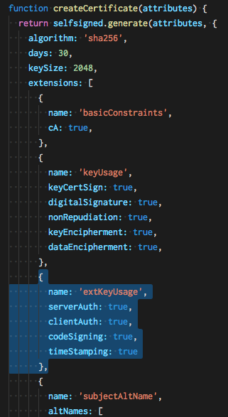

# webpack-dev-server certs not valid on macOS 10.15 (Catalina)

## What
最近macOS升级到10.15 Catalina，发现webpack-dev-server在Chrome下面没法运行了。在提示ERR_CERT_INVALID的页面，按照之前的方式点击Advanced按钮，再想要去点击Proceed或者Visit Site发现只有错误提示，没法授权访问页面。这样自动签名的证书没法在Chrome下本地调试了，试了一下Safari还是可以访问站点，但是debug的易用性没有Safari好用。

## Why
查找了一番资料后发现，原来是macOS升级到10.15后，对网站的证书有了更高的要求，额外需要一个ExtendedKeyUsage的扩展属性。详情可以看这里：[Requirements for trusted certificates in iOS 13 and macOS 10.15](https://support.apple.com/en-us/HT210176); 虽然并没有解释为什么Safari还可以访问但Chrome缺不行，但知道原因就好办了。

## How
这个问题webpack-dev-server的开发者也发现，但是修复给出的答复时间是：near future。所以想要解决还是先临时自己动手解决下。
1. 打开node_modules目录，找到webpack-dev-server
2. 在lib/utils下找到createCertificate.js文件
3. 在创建自签名证书的参数里，找到返回extensions的数组，增加如下属性：
``` json
      {
        name: 'extKeyUsage',
        serverAuth: true,
        clientAuth: true,
        codeSigning: true,
        timeStamping: true
      },
```
添加效果如图所示

4. 删除ssl目录下的server.pem文件
5. 再次启动webpack-dev-server会生成新的证书

好了，在webpack-dev-server新版本修复之前，你可以继续在Chrome上改bug了！